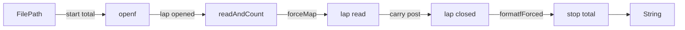
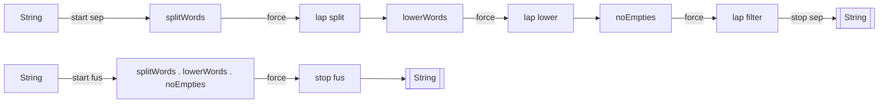

# circuits-meter

Performance measurement as a `Circuit`.

The four things you actually call:

```haskell
import Circuit.Meter.Time
import Circuit.Meter.Space

-- 1. Time a single pure function call.
tick :: (NFData b) => (a -> b) -> a -> IO (Nanos, b)

-- 2. Time @n@ calls and average the results.
ticksN :: (NFData b) => Int -> (a -> b) -> a -> IO (Nanos, b)

-- 3. Time @n@ 'IO' actions and average the results.
ticksION :: Int -> IO a -> IO (Nanos, a)

-- 4. Measure time and allocation together.
both timeX allocX :: Meter (Kleisli IO) (Nanos, Bytes) (Nanos, Bytes)
```

For raw per-run distributions, use `ticks` (pure) or `timesK` (Kleisli).
For custom meters, build a `Meter` with `mkMeter` and wrap an arrow with
`meterAction`.

## Stopwatch pipeline example

Drop named markers into a left-to-right pipeline. The timing log travels on a
`(,)` wire alongside the payload, so you see exactly where time is spent — and
where laziness hides it.

```haskell
import Circuit
import Circuit.Meter.Stopwatch
import Circuit.Meter.Time (timeX)
import Control.Arrow (Kleisli (..))
import Control.Category ((>>>))

wordPipeline ::
  Trace (,) (Kleisli IO) FilePath (String, Watches Nanos Nanos)
wordPipeline =
  start timeX "total"
    >>> carryT openf
    >>> lap timeX "opened"
    >>> carryT readAndCount
    >>> carry forceMap            -- stop laziness from shifting cost
    >>> lap timeX "read"
    >>> carry post
    >>> lap timeX "closed"
    >>> carryT formatfForced
    >>> stop timeX "total"
```



Without the `forceMap` stage the map produced by `readAndCount` is lazy, so the
counting work is forced later by `formatfForced` and appears under "total":

| interval | without `forceMap` | with `forceMap` |
|---|---|---|
| opened  | 0.56 ms | 0.30 ms |
| read    | 3.52 ms | **51.28 ms** |
| closed  | 0.01 ms | 0.01 ms |
| total   | **50.31 ms** | 0.54 ms |

The stopwatch wire makes the shift explicit: the same program, with one extra
`force` composition point, reports a completely different bottleneck.

## Laziness, WHNF, and NF

The library does not decide how much to force. That is just another Kleisli
stage between markers:

```haskell
carry (Kleisli (pure . f))        -- return a thunk
carry (Kleisli (evaluate . f))    -- force to WHNF
carry (Kleisli (evaluate . force . f))  -- force to NF
```

This keeps maximum visibility: you choose the evaluation boundary, and the meter
records what happens there.

## Function-composition experiment

The same marker style exposes fusion. Compare separate stages against a fused
composition on 100,000 words:

| variant | split | lower | filter | total |
|---|---|---|---|---|
| separate, lazy force at end | <0.001 ms | <0.001 ms | <0.001 ms | **448 ms** |
| separate, force after each stage | 316 ms | 119 ms | 23 ms | 458 ms |
| fused, single force | — | — | — | **329 ms** |

Without intermediate forces all cost collapses into the final stop. With forces
the cost is distributed across stages. The fused version is faster because GHC
can combine `splitWords >>> lowerWords >>> noEmpties` into a single pass.



## Space analytics

Replace `timeX` with `allocX` or combine them with `both timeX allocX` to record
nanoseconds and allocated bytes at every marker. For very large text you could
chunk the input and see allocation per chunk:

```haskell
chunkMeter = meterIt (both timeX allocX) "chunk"
```

## Baseline / calibration

The heavy micro-benchmark harness (`baseline` and `alloc-probe`) has been
moved out of this package and into
[perf-circuits](https://github.com/tonyday567/perf-circuits), the sibling
repo with larger-scale circuit performance examples. What remains here is
the public metering library plus the `perf-bench` and `nub` runners.
